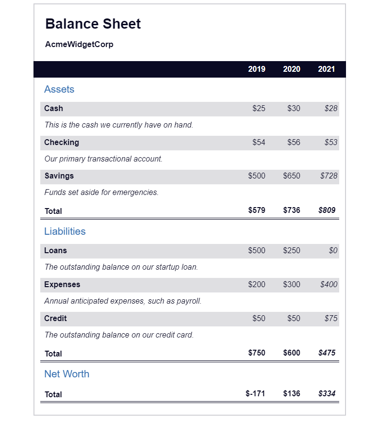

# freeCodeCamp - Balance Sheet
This is my solution to the Balance Sheet mini-project (https://www.freecodecamp.org/learn)

## Table of contents

- [Overview](#overview)
  - [The challenge](#the-challenge)
  - [Screenshot](#screenshot)
  - [Links](#links)
- [My process](#my-process)
  - [Built with](#built-with)
  - [What I learned](#what-i-learned)
  - [Continued development](#continued-development)

## Overview

### The challenge

- In this project, I built a balance sheet using pseudo selectors. I learned how to change the style of an element when you hover over it with your mouse, and trigger other events on my webpage.

### Screenshot



### Links

- Solution URL: (https://github.com/Caius-Scipio/freeCodeCamp/tree/main/ResponsiveWebDesign/BalanceSheet)

## My process

### Built with

- Semantic HTML5 markup
- CSS custom properties
- Accessibility

### What I learned

- My major takeaway from this project was how pseudo selectors are used to target specific elements as well as trigger a few events such as hover or focus, but also how to add tables to a webpage.

Below is some code that I found most interesting or am proud of:

```html
<table>
    <caption>Liabilities</caption>
        <thead>
            <tr>
            <td></td>
            <th><span class="sr-only">2019</span></th>
            .
            .
            .
        </thead>
        <tbody>
            <tr class="data">
                <th>Loans <span class="description">The outstanding balance on our startup loan.</span></th>
                <td>$500</td>
                .
                .
                .
```

```CSS
tbody th {
  width: calc(100% - 12rem);
}

tr[class="total"] th {...}

tr.data {
  background-image: linear-gradient(to bottom, #dfdfe2 1.845rem, white 1.845rem);
}
```

### Continued development

- I had not thought equations could be used to set margins of a page withing a width selector. This is something I'd like to look into and see if it's a best practice or something a bit unique for this type of project.