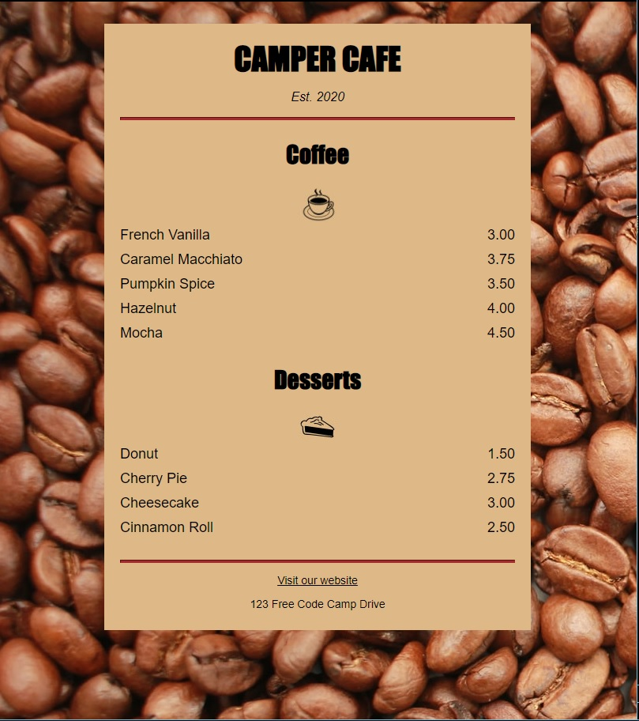

# freeCodeCamp - Cafe Menu
This is my solution to the Cafe Menu mini-project (https://www.freecodecamp.org/learn)

## Table of contents

- [Overview](#overview)
  - [The challenge](#the-challenge)
  - [Screenshot](#screenshot)
  - [Links](#links)
- [My process](#my-process)
  - [Built with](#built-with)
  - [What I learned](#what-i-learned)
  - [Continued development](#continued-development)

## Overview

### The challenge

- In this project, we covered CSS by designing a menu page for a cafe webpage.

### Screenshot



### Links

- Solution URL: (https://github.com/Caius-Scipio/freeCodeCamp/tree/main/ResponsiveWebDesign/CafeMenu)

## My process

### Built with

- Semantic HTML5 markup
- CSS custom properties

### What I learned

- My major takeaways from this project include noticing the collection of basic fundamental collections of CSS properties that'll be applied to most projects.

Below is some code that I found most interesting or am proud of:

```html
    <article class="item">
      <p class="flavor">French Vanilla</p><p class="price">3.00</p>
    </article>
```

```CSS
    .item p {
      display: inline-block;
      margin-top: 5px;
      margin-bottom: 5px;
      font-size: 18px;
    }
```

### Continued development

- During the development, I was reminded of selecting nested elements within a class that can be styled separately.