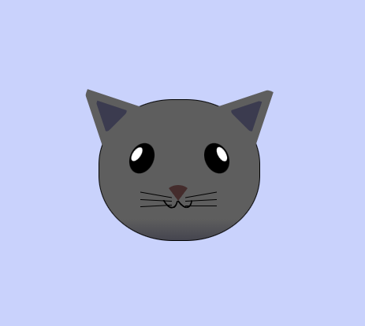

# freeCodeCamp - Cat Painting
This is my solution to the Cat Painting mini-project (https://www.freecodecamp.org/learn)

## Table of contents

- [Overview](#overview)
  - [The challenge](#the-challenge)
  - [Screenshot](#screenshot)
  - [Links](#links)
- [My process](#my-process)
  - [Built with](#built-with)
  - [What I learned](#what-i-learned)
  - [Continued development](#continued-development)

## Overview

### The challenge

- In this project, more CSS properties were introduced.

### Screenshot



### Links

- Solution URL: (https://github.com/Caius-Scipio/freeCodeCamp/tree/main/ResponsiveWebDesign/CatPainting)

## My process

### Built with

- Semantic HTML5 markup
- CSS custom properties

### What I learned

- My major takeaway from this project were learning more about media queries and and aplying them in new and interesting ways.

Below is some code that I found most interesting or am proud of:

```CSS
.cat-mouth div {
    width: 30px;
    height: 50px;
    border: 2px solid #000;
    border-radius: 190%/190px 150px 0 0;
    border-color: black transparent transparent transparent;
  }
```

### Continued development

- The border radius value was interesting and showed me that more properties can take formulae leading me to wonder what other properties can take formulae.