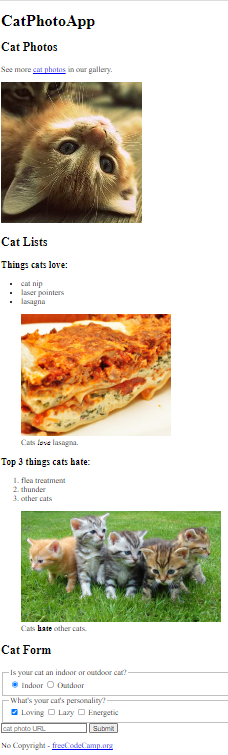

# freeCodeCamp - Cat Photo App
This is my solution to the Cat Photo App mini-project (https://www.freecodecamp.org/learn)

## Table of contents

- [Overview](#overview)
  - [The challenge](#the-challenge)
  - [Screenshot](#screenshot)
  - [Links](#links)
- [My process](#my-process)
  - [Built with](#built-with)
  - [What I learned](#what-i-learned)
  - [Continued development](#continued-development)

## Overview

### The challenge

- In this project, we covered the most common HTML tags by building our own cat photo app.

### Screenshot



### Links

- Solution URL: (https://github.com/Caius-Scipio/freeCodeCamp/blob/main/ResponsiveWebDesign/CatPhotoApp/index.html)

## My process

### Built with

- Semantic HTML5 markup

### What I learned

- My major takeaways from this project include the use of "legend", the common input attributes and how they are used, and two ways to use "label."

Below is some code I am proud of:

```html
    <fieldset>
        <legend>What's your cat's personality?</legend>
        <input id="loving" type="checkbox" name="personality" value="loving" checked> <label for="loving">Loving</label>
        <input id="lazy" type="checkbox" name="personality" value="lazy"> <label for="lazy">Lazy</label>
        <input id="energetic" type="checkbox" name="personality" value="energetic"> <label for="energetic">Energetic</label>
    </fieldset>
```

### Continued development

- During the development, comments were made about how some tags or attributes are important for accessibility and how text to speech readers vary in their interpretation of the HTML. I'd like to learn more bout how to best develop sites with them in mind.