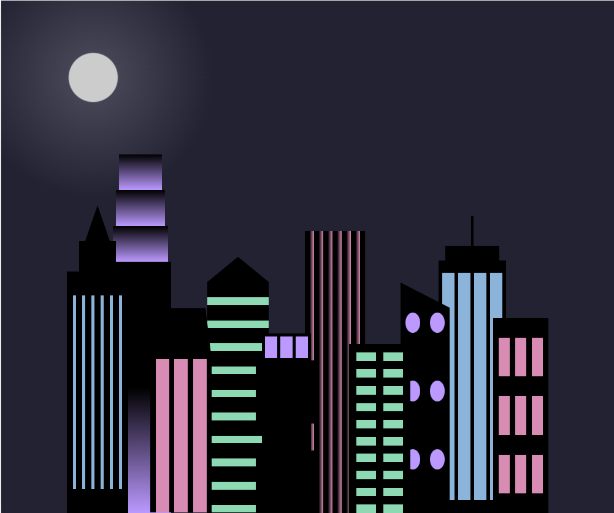
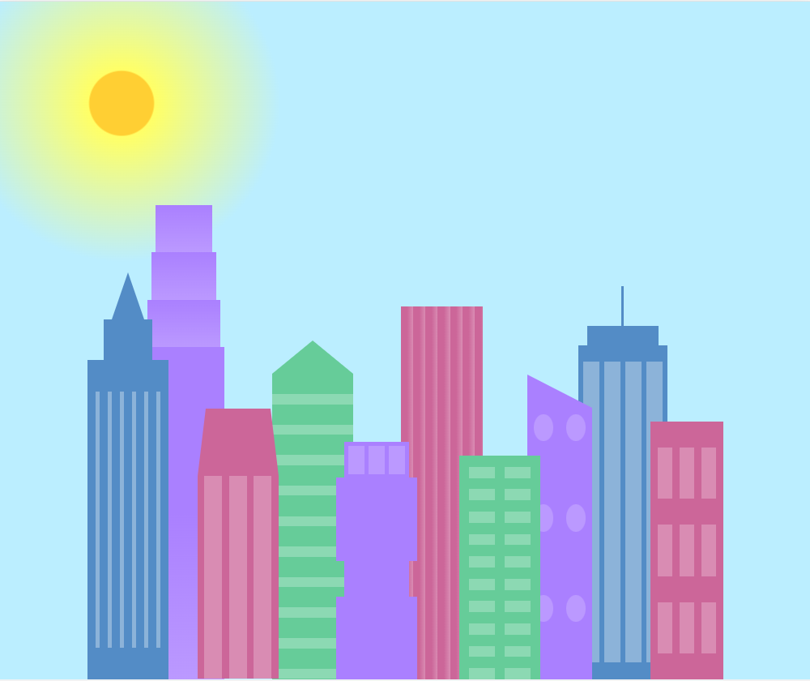

# freeCodeCamp - City Skyine
This is my solution to the City Skyline mini-project (https://www.freecodecamp.org/learn)

## Table of contents

- [Overview](#overview)
  - [The challenge](#the-challenge)
  - [Screenshot](#screenshot)
  - [Links](#links)
- [My process](#my-process)
  - [Built with](#built-with)
  - [What I learned](#what-i-learned)
  - [Continued development](#continued-development)

## Overview

### The challenge

- In this project, the challenge was to configure CSS variables so you can reuse them whenever you want.

### Screenshot

- View changes based on screen size:



### Links

- Solution URL: (https://github.com/Caius-Scipio/freeCodeCamp/tree/main/ResponsiveWebDesign/CitySkyline)

## My process

### Built with

- Semantic HTML5 markup
- CSS custom properties
- Responsive Design

### What I learned

- My major takeaway from this project was learning how to make and use the CSS properties as well as their usefuleness to quickly change the look of a page.

Below is some code that I found most interesting or am proud of:

```HTML
<div class="bb1 building-wrap">
    <div class="bb1a bb1-window"></div>
    <div class="bb1b bb1-window"></div>
    <div class="bb1c bb1-window"></div>
    <div class="bb1d"></div>
</div>
```

```CSS
.bb1d {
    width: 100%;
    height: 70%;
    background: linear-gradient(
        var(--building-color1) 50%,
        var(--window-color1)
    );
  }
```

### Continued development

- I'd like to learn what other propeties are often assigned as variables for a web page or if it's more of a per-project need.