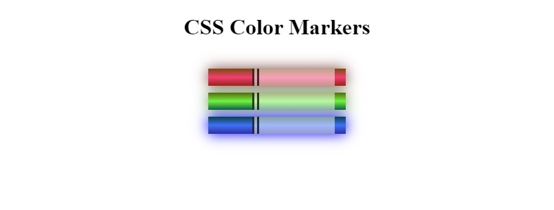

# freeCodeCamp - Colored Markers
This is my solution to the Colored Markers mini-project (https://www.freecodecamp.org/learn)

## Table of contents

- [Overview](#overview)
  - [The challenge](#the-challenge)
  - [Screenshot](#screenshot)
  - [Links](#links)
- [My process](#my-process)
  - [Built with](#built-with)
  - [What I learned](#what-i-learned)
  - [Continued development](#continued-development)

## Overview

### The challenge

- In this project, we built a set of colored markers and then learned different ways to set color values and how to pair colors with each other.

### Screenshot



### Links

- Solution URL: (https://github.com/Caius-Scipio/freeCodeCamp/tree/main/ResponsiveWebDesign/ColoredMarkers)

## My process

### Built with

- Semantic HTML5 markup
- CSS custom properties

### What I learned

- My major takeaways from this project include a greater understanding of the hsl and hex color values as well as using the border to help produce an image.

Below is some code that I found most interesting or am proud of:

```html
<div class="marker red">
  <div class="cap"></div>
  <div class="sleeve"></div>
</div>
```

```CSS
.sleeve {
  width: 110px;
  height: 25px;
  background-color: rgba(255, 255, 255, 0.5);
  border-left: 10px double rgba(0, 0, 0, 0.75);
}
```

### Continued development

- Both rgb and hsl are a bit more intuitive for me, I'd like to dive deeper into hex and know more about how the naming convention produces the color. I'm still unsure how a single-digit scale of 1-9 and A-F combine in a two-digit number to produce a color.