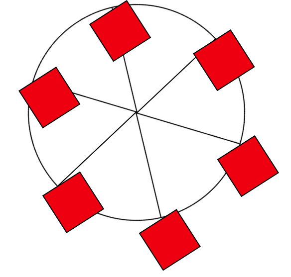

# freeCodeCamp - Ferris Wheel
This is my solution to the Ferris Wheel mini-project (https://www.freecodecamp.org/learn)

## Table of contents

- [Overview](#overview)
  - [The challenge](#the-challenge)
  - [Screenshot](#screenshot)
  - [Links](#links)
- [My process](#my-process)
  - [Built with](#built-with)
  - [What I learned](#what-i-learned)
  - [Continued development](#continued-development)

## Overview

### The challenge

- In this project, the challenge was to build a Ferris Wheel to learn how to use CSS to animate elements, transform them, and adjust their speed.

### Screenshot



### Links

- Solution URL: (https://github.com/Caius-Scipio/freeCodeCamp/tree/main/ResponsiveWebDesign/FerrisWheel)

## My process

### Built with

- CSS custom properties
- Responsive Design

### What I learned

- My major takeaway from this project was learning how keyframes work as well as how to use them in CSS.

Below is some code that I found most interesting or am proud of:

```CSS
@keyframes cabins {
    0% {
        transform: rotate(0deg);
    }
    25% {
        background-color: yellow;
    }
    50% {
        background-color: purple;
    }
    100% {
        transform: rotate(-360deg);
    }
}
```

### Continued development

- Making things move through CSS was interesting. JavaScript is normally said to do this. I'd like to learn what are the differences between the two options, such as efficiency and purpose.