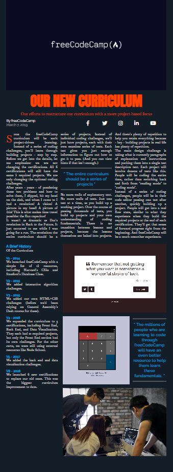

# freeCodeCamp - Magazine
This is my solution to the Magazine mini-project (https://www.freecodecamp.org/learn)

## Table of contents

- [Overview](#overview)
  - [The challenge](#the-challenge)
  - [Screenshot](#screenshot)
  - [Links](#links)
- [My process](#my-process)
  - [Built with](#built-with)
  - [What I learned](#what-i-learned)
  - [Continued development](#continued-development)

## Overview

### The challenge

- In this project, the challenge was to build a magazine article to learn how to use CSS Grid, including concepts like grid rows and grid columns.

### Screenshot



### Links

- Solution URL: (https://github.com/Caius-Scipio/freeCodeCamp/tree/main/ResponsiveWebDesign/Magazine)

## My process

### Built with

- Semantic HTML5 markup
- CSS custom properties
- Responsive Design

### What I learned

- My major takeaway from this project was having a better grasp and understanding of how CSS Grid works.

Below is some code that I found most interesting or am proud of:

```HTML
<div class="social-icons">
    <a href="https://www.facebook.com/freecodecamp/">
        <i class="fab fa-facebook-f"></i>
    </a>
    .
    .
    .
```

```CSS
main {
  display: grid;
  grid-template-columns: minmax(2rem, 1fr) minmax(min-content, 94rem) minmax(2rem, 1fr);
  row-gap: 3rem;
}
```

### Continued development

- As CSS Grid is not as intuitive as CSS Flexbox, I'd like to spend time working more on projects that use it.