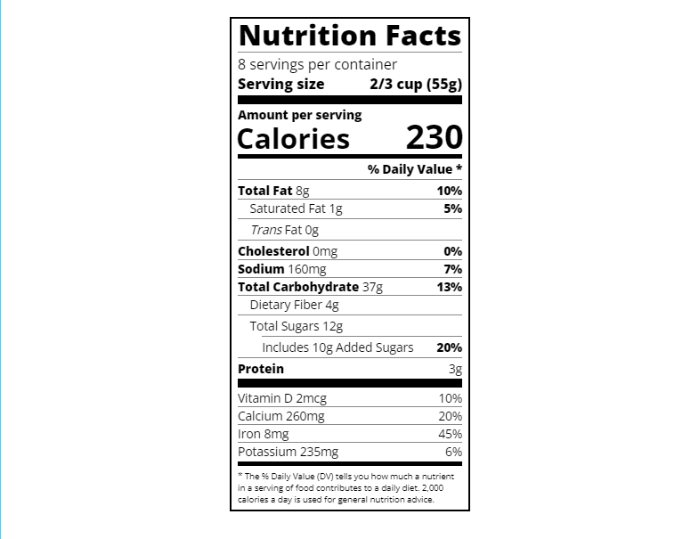

# freeCodeCamp - Nutrition Label
This is my solution to the Nutrition Label mini-project (https://www.freecodecamp.org/learn)

## Table of contents

- [Overview](#overview)
  - [The challenge](#the-challenge)
  - [Screenshot](#screenshot)
  - [Links](#links)
- [My process](#my-process)
  - [Built with](#built-with)
  - [What I learned](#what-i-learned)
  - [Continued development](#continued-development)

## Overview

### The challenge

- In this project, I used typography to build a nutrition label webpage. I learned how to style text, adjust line height, and position text using CSS.

### Screenshot



### Links

- Solution URL: (https://github.com/Caius-Scipio/freeCodeCamp/tree/main/ResponsiveWebDesign/NutritionLabel)

## My process

### Built with

- Semantic HTML5 markup
- CSS custom properties
- CSS Flexbox

### What I learned

- My major takeaway from this project was how CSS classes can be used functionally to style many different sections instead of styling each section individually.

Below is some code that I found most interesting or am proud of:

```html
<div class="daily-value small-text">
    <p class="bold right no-divider">% Daily Value *</p>
    <div class="divider"></div>
    <p><span><span class="bold">Total Fat</span> 8g</span> <span class="bold">10%</span></p>
    <p class="indent no-divider">Saturated Fat 1g <span class="bold">5%</span></p>
    <div class="divider"></div>
    .
    .
    .
```

```CSS
.divider {
    border-bottom: 1px solid #888989;
    margin: 2px 0;
}

.bold {
    font-weight: 800;
}
```

### Continued development

- In JavaScript, there is object oriented programming and functional programming. This project got me wondering if something similar exists in CSS and where one style is prerferred over the other.