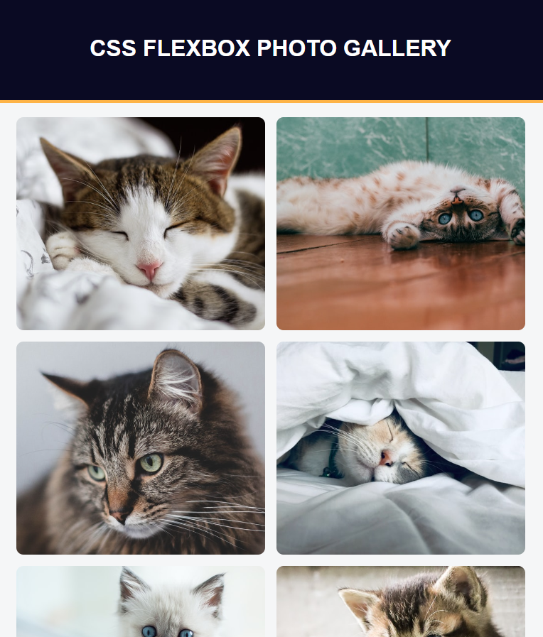

# freeCodeCamp - Photo Gallery
This is my solution to the Photo Gallery mini-project (https://www.freecodecamp.org/learn)

## Table of contents

- [Overview](#overview)
  - [The challenge](#the-challenge)
  - [Screenshot](#screenshot)
  - [Links](#links)
- [My process](#my-process)
  - [Built with](#built-with)
  - [What I learned](#what-i-learned)
  - [Continued development](#continued-development)

## Overview

### The challenge

- In this project, we used Flexbox to build a responsive photo gallery webpage.

### Screenshot



### Links

- Solution URL: (https://github.com/Caius-Scipio/freeCodeCamp/tree/main/ResponsiveWebDesign/PhotoGallery)

## My process

### Built with

- Semantic HTML5 markup
- CSS custom properties
- CSS Flexbox

### What I learned

- My major takeaway from this project was how simple and powerful flexbox can be.

Below is some code that I found most interesting or am proud of:

```html
<div class="gallery">
      
      .
      .
      .
    </div>
```

```CSS
.gallery {
    display: flex;
    flex-direction: row;
    flex-wrap: wrap;
    justify-content: center;
    align-items: center;
    .
    .
    .
  }
```

### Continued development

- Flexbox is so intuitive, I'd like to get a greater understanding of more of its features such as setting content sizes when the items are not the same size.