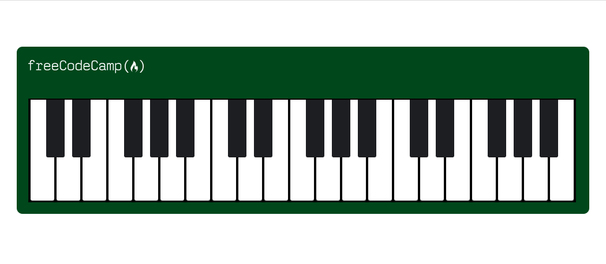

# freeCodeCamp - Piano
This is my solution to the Piano mini-project (https://www.freecodecamp.org/learn)

## Table of contents

- [Overview](#overview)
  - [The challenge](#the-challenge)
  - [Screenshot](#screenshot)
  - [Links](#links)
- [My process](#my-process)
  - [Built with](#built-with)
  - [What I learned](#what-i-learned)
  - [Continued development](#continued-development)

## Overview

### The challenge

- In this project, I had to use CSS and Responsive Design to code a piano to be viewed on various screen sizes.

### Screenshot



### Links

- Solution URL: (https://github.com/Caius-Scipio/freeCodeCamp/tree/main/ResponsiveWebDesign/Piano)

## My process

### Built with

- Semantic HTML5 markup
- CSS custom properties
- Responsive Web Design

### What I learned

- My major takeaway from this project were learning more about media queries and pseudo selectors.

Below is some code that I found most interesting or am proud of:

```html
<div class="keys">
        <div class="key"></div>
        <div class="key black--key"></div>
        <div class="key black--key"></div>
        <div class="key"></div>
        .
        .
        .
```

```CSS
.key.black--key::after {
    .
    .
    .
  }

@media (max-width: 1199px) and (min-width: 769px) {
    .
    .
    .
  }

```

### Continued development

- With the media queries adjusting for sizes, I wonder if the breakpoints are determined by some industry standard, by the design itself, a combination, or even some other variable such as the browser being used.