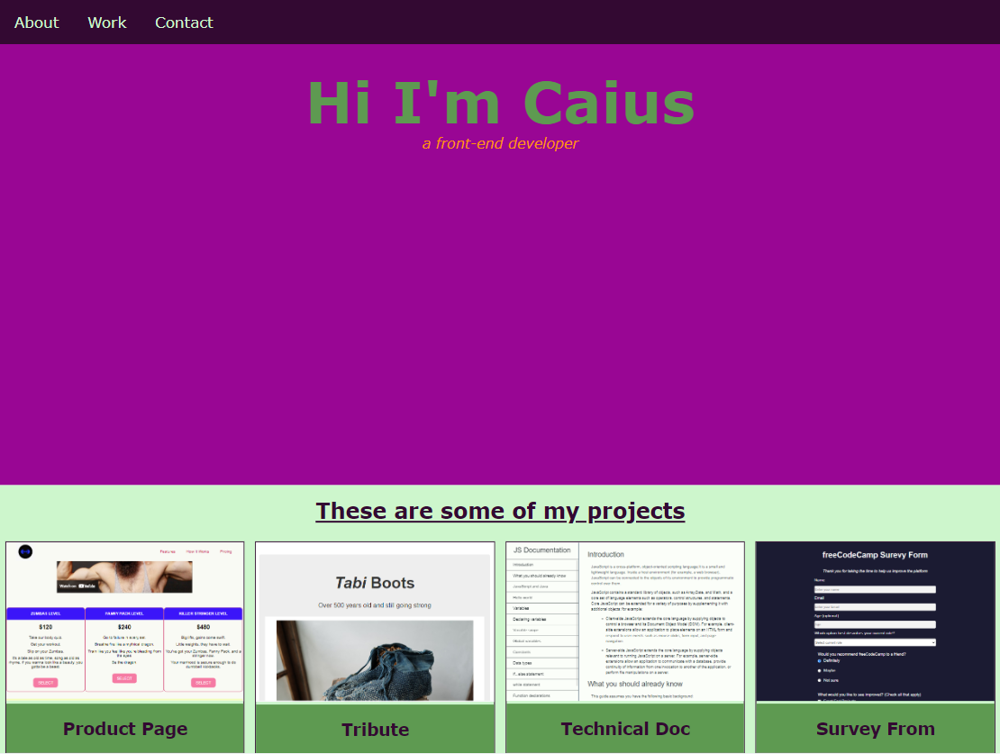

# freeCodeCamp - Portfolio
This is my solution to the Portfolio project (https://www.freecodecamp.org/learn)

## Table of contents

- [Overview](#overview)
  - [The challenge](#the-challenge)
  - [Screenshot](#screenshot)
  - [Links](#links)
- [My process](#my-process)
  - [Built with](#built-with)
  - [What I learned](#what-i-learned)
  - [Continued development](#continued-development)

## Overview

### The challenge

- In this project, the challenge was to build our own personal portfolio page.

### Screenshot



### Links

- Solution URL: (https://github.com/Caius-Scipio/freeCodeCamp/tree/main/ResponsiveWebDesign/Portfolio)

## My process

### Built with

- Semantic HTML5 markup
- CSS custom properties
- CSS Flexbox
- CSS Grid
- Accessibility
- Responsive Web Design

### What I learned

- My major takeaway from this project was how how long a site can take to code. Even when emulating from an example, breaking things down into indivdual components can take time. But that's also how a mammoth project can get done; one piece at a time.

Below is some code that I found most interesting or am proud of:

```html
<div class="card">
    <a target="_blank" href="https://...">
        
    </a>
    <div class="project-title"><h3>Product Page</h3></div>
</div>
```

```CSS
.clearfix:after {
    content: "";
    display: table;
    clear: both;
}
```

### Continued development

- This was a great project that was both frustrating and exciting as I found nuances of the example and found my own way of coding them to make them work. I think finding other examples of sites and elements of sites would be a great way to practice skills and build a repitoire to build other sites from.