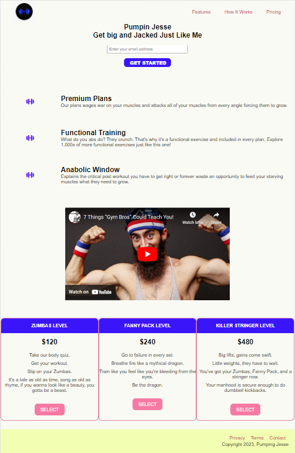

# freeCodeCamp - Product Landing Page
This is my solution to the Product Landing Page Project (https://www.freecodecamp.org/learn)

## Table of contents

- [Overview](#overview)
  - [The challenge](#the-challenge)
  - [Screenshot](#screenshot)
  - [Links](#links)
- [My process](#my-process)
  - [Built with](#built-with)
  - [What I learned](#what-i-learned)
  - [Continued development](#continued-development)

## Overview

### The challenge

- In this project, the challenge was to build a product landing page for a product of my choice that included: a header, a header image, a nav bar, nav links to parts of the page, a video, a form, a media query, and Flexbox.

### Screenshot



### Links

- Solution URL: (https://github.com/Caius-Scipio/freeCodeCamp/tree/main/ResponsiveWebDesign/ProductLandingPage)

## My process

### Built with

- Semantic HTML5 markup
- CSS custom properties
- CSS Flexbox
- CSS Grid
- Responsive Design

### What I learned

- My major takeaway from this project was working piece by piece, one at a time, a whole project can be done relatively easily.

Below is some code that I found most interesting or am proud of:

```HTML
<div class="grid">
    <div class="icon"><i class="fas fa-dumbbell fa-lg"></i></div>
    <div class="desc">
        <h2>Premium Plans</h2>
```

```CSS
* {
    .
    .
    .
    --text: #0A0B05;
    --background: #F9FAF4;
    --primary: #3B15F9;
    --secondary: #F2FFB3;
    --accent: #C70F4C;
  }

  body {
    background-color: var(--background);
    .
    .
    .
    color: var(--text)
  }
```

### Continued development

- This was a fun project turning a parody video into a product site. It's pretty bare-bones now, but something to build up more over time into something more beautiful.