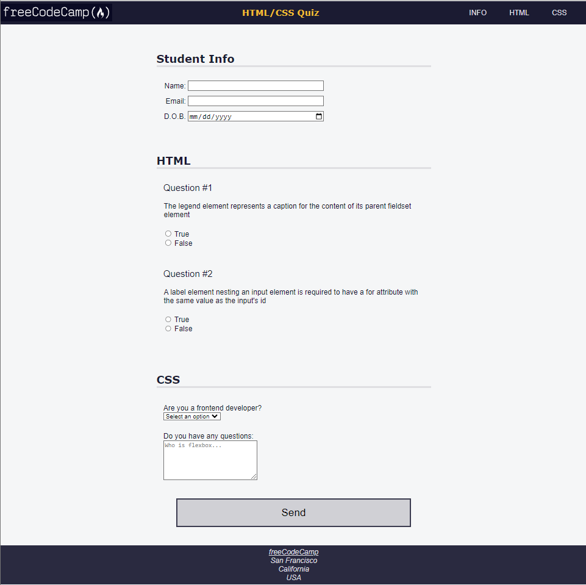

# freeCodeCamp - Quiz
This is my solution to the Quiz mini-project (https://www.freecodecamp.org/learn)

## Table of contents

- [Overview](#overview)
  - [The challenge](#the-challenge)
  - [Screenshot](#screenshot)
  - [Links](#links)
- [My process](#my-process)
  - [Built with](#built-with)
  - [What I learned](#what-i-learned)
  - [Continued development](#continued-development)

## Overview

### The challenge

- In this project, I built a quiz webpage to learn accessibility tools such as keyboard shortcuts, ARIA attributes, and design best practices.

### Screenshot



### Links

- Solution URL: (https://github.com/Caius-Scipio/freeCodeCamp/tree/main/ResponsiveWebDesign/Quiz)

## My process

### Built with

- Semantic HTML5 markup
- CSS custom properties
- CSS Flexbox
- Accessibility

### What I learned

- My major takeaways from this project were how the "for", "name", and "id" attributes worked together for accessibility, but also how information can be baked into the site that can only be seen and read by a screen reader.

Below is some code that I found most interesting or am proud of:

```html
<form method="post" action="https://freecodecamp.org/practice-project/accessibility-quiz">
        <section role="region" aria-labelledby="student-info">
          .
          .
          .
          <div class="info">
            <label for="birth-date">D.O.B.<span class="sr-only">(Date of Birth)</span></label>
            <input type="date" name="birth-date" id="birth-date" />
          </div>
        .
            .
                .
                <li>
                  <label for="q1-a1">
                    <input type="radio" id="q1-a1" name="q1" value="true" />
                    True
                  </label>
                </li>
                .
                .
                .
```

```CSS
@media (prefers-reduced-motion: no-preference) {
  * {
    scroll-behavior: smooth;
  }
}

.sr-only {
  position: absolute;
  width: 1px;
  height: 1px;
  padding: 0;
  margin: -1px;
  overflow: hidden;
  clip: rect(0, 0, 0, 0);
  white-space: nowrap;
  border: 0;
}
```

### Continued development

- The CSS code ".sr-only" showed how we can code explanations to screen readers that don't show up on the web page. This will be a useful tool to add to future projects when acronyms, for example, might be unfamiliar to the reader.