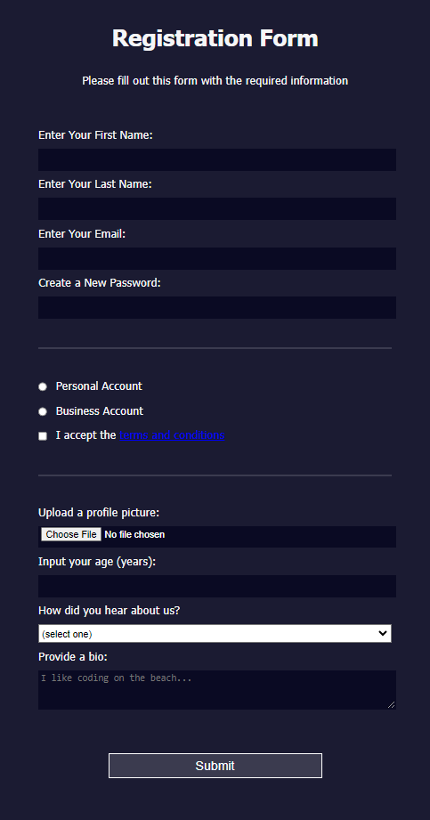

# freeCodeCamp - Registration Form
This is my solution to the Registration Form mini-project (https://www.freecodecamp.org/learn)

## Table of contents

- [Overview](#overview)
  - [The challenge](#the-challenge)
  - [Screenshot](#screenshot)
  - [Links](#links)
- [My process](#my-process)
  - [Built with](#built-with)
  - [What I learned](#what-i-learned)
  - [Continued development](#continued-development)

## Overview

### The challenge

- In this project, we learned HTML forms by building a signup page, how to control what types of data people can type into a form, and some new CSS tools for styling the page.

### Screenshot



### Links

- Solution URL: (https://github.com/Caius-Scipio/freeCodeCamp/tree/main/ResponsiveWebDesign/RegistrationForm)

## My process

### Built with

- Semantic HTML5 markup
- CSS custom properties

### What I learned

- My major takeaways from this project include a greater understanding of how forms can be coded for both accessibility as well as how simple it is to identify information to be sent to a database.

Below is some code that I found most interesting or am proud of:

```html
<form method="post"
      action='https://register-demo.freecodecamp.org'>
  <fieldset>
    ...
    <label for="new-password">Create a New Password:
      <input id="new-password"
            name="new-password"
            type="password"
            pattern="[a-z0-5]{8,}"
            required />
      </label>
  </fieldset>
```

```CSS
input[type="submit"] {
  ...
}
```

### Continued development

- With forms such as this one ubiquitous, it is inevitable that some users wil maliciously use it for their own purposes. Learning more about how to prevent this with additional security options is an area I'd like to learn more about.