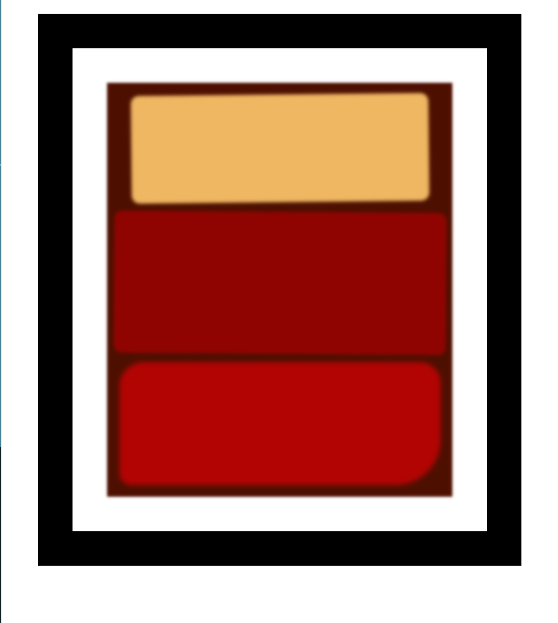

# freeCodeCamp - Rothko Painting
This is my solution to the Rothko Painting mini-project (https://www.freecodecamp.org/learn)

## Table of contents

- [Overview](#overview)
  - [The challenge](#the-challenge)
  - [Screenshot](#screenshot)
  - [Links](#links)
- [My process](#my-process)
  - [Built with](#built-with)
  - [What I learned](#what-i-learned)
  - [Continued development](#continued-development)

## Overview

### The challenge

- In this project, we used CSS and the Box Model to create our own Rothko-style rectangular art piece.

### Screenshot



### Links

- Solution URL: (https://github.com/Caius-Scipio/freeCodeCamp/tree/main/ResponsiveWebDesign/RothkoPainting)

## My process

### Built with

- Semantic HTML5 markup
- CSS custom properties

### What I learned

- My major takeaways from this project was not only an how easy it is to remember the box model, but how little code is needed to create designs.

Below is some code that I found most interesting or am proud of:

```html
<body>
  <div class="frame">
    <div class="canvas">
      <div class="one"></div>
      <div class="two"></div>
      <div class="three"></div>
      </div>
    </div>
</body>
```

```CSS
.one, .two {
  filter: blur(1px);
}
```

### Continued development

- CSS files can get bloated and over complicated at times. There is something appealing about minimalism. Maybe it's not always possible, but I'd like to try and reduce the amount needed code where possible.