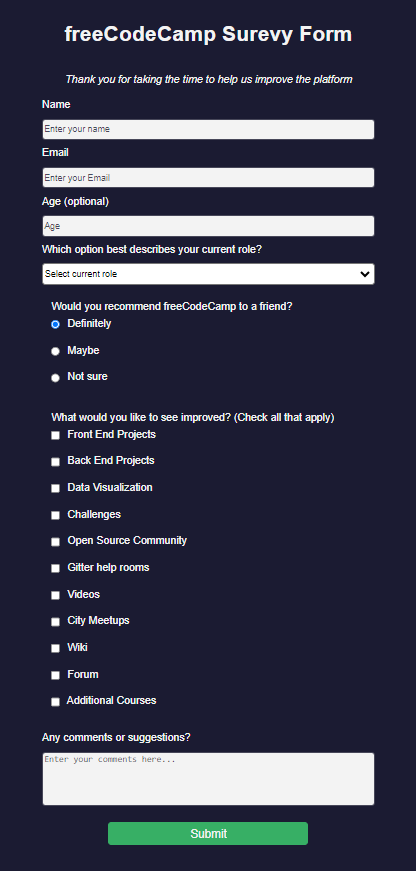

# freeCodeCamp - Survey Form
This is my solution to the Registration Form project (https://www.freecodecamp.org/learn)

## Table of contents

- [Overview](#overview)
  - [The challenge](#the-challenge)
  - [Screenshot](#screenshot)
  - [Links](#links)
- [My process](#my-process)
  - [Built with](#built-with)
  - [What I learned](#what-i-learned)
  - [Continued development](#continued-development)

## Overview

### The challenge

- In this project, we were tasked to create a survey form to collect data from users based on an active live form. The CSS styling was unguided and is mine and intended to reflect a similar feel of the original.

### Screenshot



### Links

- Solution URL: (https://github.com/Caius-Scipio/freeCodeCamp/tree/main/ResponsiveWebDesign/SurveyForm)

## My process

### Built with

- Semantic HTML5 markup
- CSS custom properties

### What I learned

- My major takeaways from this project are how a few simple tweaks to a few attributes can create a different feeling and looking object on the web and we should feel free to experiment with colors, spacing, and sizes.

Below is some code that I found most interesting or am proud of:

```html
<label for="role">Which option best describes your current role?
    <select id="dropdown" name="role">
        <option value="">Select current role</option>
        <option value="1">Student</option>
        <option value="2">Full Time Job</option>
        <option value="3">Full Time Learner</option>
        <option value="4">Prefer Not To Say</option>
        <option value="5">Other</option>
    </select>
</label>
```

```CSS
html {
  --white: #f3f3f3;
  --darkblue: #1b1b32;
  --darkblue-alpha: rgba(27, 27, 50, 0.8);
  --green: #37af65;
}
```

### Continued development

- Color and color combinations are a real struggle for me beyond the primary and secondary color spectrum. Learning more about color theory and how that translates to color values will help me make more attractive content for the web.