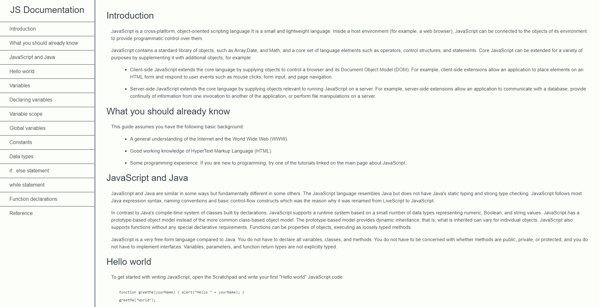

# freeCodeCamp - Technical Documentation
This is my solution to the Technical Documentation project (https://www.freecodecamp.org/learn)

## Table of contents

- [Overview](#overview)
  - [The challenge](#the-challenge)
  - [Screenshot](#screenshot)
  - [Links](#links)
- [My process](#my-process)
  - [Built with](#built-with)
  - [What I learned](#what-i-learned)
  - [Continued development](#continued-development)

## Overview

### The challenge

- In this project, the challenge was to produce a technical documentation page to serve as instruction or reference for a topic.

### Screenshot



### Links

- Solution URL: (https://github.com/Caius-Scipio/freeCodeCamp/tree/main/ResponsiveWebDesign/TechnicalDocumentation)

## My process

### Built with

- Semantic HTML5 markup
- CSS custom properties

### What I learned

- My major takeaway from this project was learning how to link a navigation bar to move or jump to a different part of a page.

Below is some code that I found most interesting or am proud of:

```HTML
    .
    .
    .
 <li><a class="nav-link" href="#Reference">Reference</a></li>
    .
    .
    .
 <section class="main-section" id="Reference">
    <header>Reference</header>
    .
    .
    .
```

```CSS
code {
  white-space: pre-line;
  word-break: normal;
  word-wrap: normal;
  .
  .
  .
}
```

### Continued development

- As web pages are being made more and more as a single page, this technique would be very useful to assist in user expereince to quickly navigate the page. Learning more techniques like this would be very beneficial.