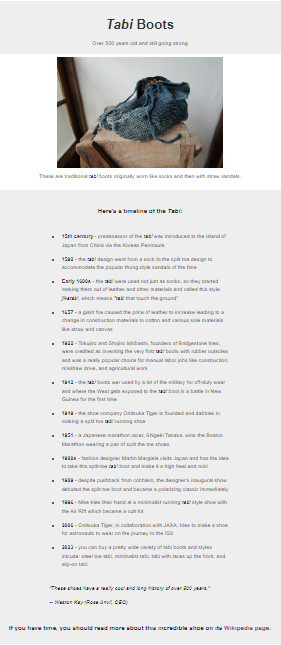

# freeCodeCamp - Tribute Page
This is my solution to the Tribute Page project (https://www.freecodecamp.org/learn)

## Table of contents

- [Overview](#overview)
  - [The challenge](#the-challenge)
  - [Screenshot](#screenshot)
  - [Links](#links)
- [My process](#my-process)
  - [Built with](#built-with)
  - [What I learned](#what-i-learned)
  - [Continued development](#continued-development)

## Overview

### The challenge

- In this project, the challenge was to build a tribute page of our choosing. I chose to create one about the history of the Japanese tabi.

### Screenshot



### Links

- Solution URL: (https://github.com/Caius-Scipio/freeCodeCamp/tree/main/ResponsiveWebDesign/TributePage)

## My process

### Built with

- Semantic HTML5 markup
- CSS custom properties

### What I learned

- My major takeaway from this project was how everything worked together to produce the final result. Choosing colors was challenging and something I'd need to work on in the future, but also sometimes choices needed to be made with no clear answer.

Below is some code that I found most interesting or am proud of:

```html
<ul>
    <li><strong>15th century</strong> - predecessor of the <span class="italics">tabi</span> was introduced to the island of Japan from China via the Korean Peninsula</li>
    <li><strong>1592</strong> - the <span class="italics">tabi</span> design went from a sock to the split toe design to accommodate the popular thong style sandals of the time</li>
    .
    .
    .
```

```CSS
.italics {
    font-style: italic;
}
```

### Continued development

- I had a hard time deciding to use <i> in the HTML or the .italics in the CSS to create the italics case for the foreign words. Style should be separate from structure, but in this case the HTML would be easier and shorter to apply. Would both be equally valid approaches?